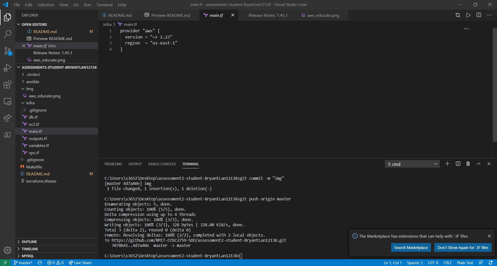
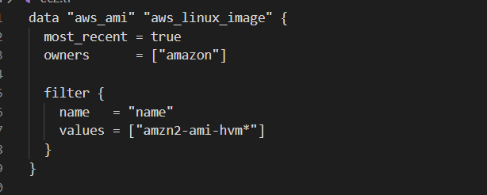

# Servian TechTestApp

## dependencies
    Here are the dependencies need to be installed for the project, with attached links.
    - aws cli
    curl "https://awscli.amazonaws.com/awscli-exe-linux-x86_64.zip" -o "awscliv2.zip" 
    - terraform:
    curl -o terraform.zip https://releases.hashicorp.com/terraform/0.12.21/terraform_0.12.21_linux_amd64.zip
    - ansible: 
    sudo apt install ansible

## deploy instructions

### store aws credential:
    Regarding we are using AWS Educate account, the place where to get credential is quiet different to normal
    AWS account. In the case, grab the account credential at workbench page, click in **Account details**, copy 
    and paste them in *.aws* folder at root directory for you OS. So that to get connected with AWS from CLI.

    
### AWS setup with terraform:
    Under the **main.tf**, specify the *provider name* with *version* and other information necessary. After that do the 
    following command:
    -terraform init
    Then terraform will go downlaod corresponding dependency(provider plugin), at the time of writing is **aws version**
    2.23.

    
## Infrastructure
### VPC:
    We have to deploy VPC for the project, in order to create the netwrok that the project will deployed into.

    [link to reference!](https://www.terraform.io/docs/providers/aws/r/vpc.html)
    

    Follow the basic usage on official website, we specify the resource we intent to build up through terraform,
    which is vpc, with the required argument (CIDR_BLOCK).

    To validate whether the configure file is valid to run:
    -terraform validate

    To rewrite config files to canonical format:
    -terraform fmt

    To see what  will  change in our environment before we run terraform apply
    -terraform plan

    To apply the change
    -terraform apply ||-terraform apply --auto-apply(no need to type yes) 

**use above command after finalized each resources**

    *further explaination*

    resource "aws_vpc" "main" 
    the first element follow by the key word "resource" "aws_vpc" is the resource we are deploying, the second element 
    "main" is pretty flexible term that we can use to describe the resource we are deploying.

    

### Internet Gateway:

    Internet Gateway is the critical component of VPC to allow communication between instance in our VPC and the internet.

    We'll deploy it within the same page, because it belongs to VPC service.

    About "VPC id" section we can either fill in "aws.vpc.main.id" as variable, either fill in the particular vpc id from 
    AWS console, they both acheive same functionality. (screenshot here) The rest part is same as we did for VPC.

    
### default route table:

    By default, default route table comes up with VPC, this resource is quiet different with others. We don't create it, instead
    we are adopting it with other services by specifing the default route table id. 

    The next section "route" is optinal, however if specify that the route table can identify internet gateway by filling in gateway 
    id . The cidr_block is required so we typed 0.0.0.0/0 to allow any inbound traffic.

    
### Subnet:

    To meet your expectation, we are heading to create 9 subnets in total, 3 in each avaliability zone so we have redundency in case
    there is an outage in AWS. In the case, we will deploy a standard three layer structre, public, private and data. 

    
    
    

### Key pair

    Key pair is to make sure we can login to the remote instances on AWS which called ec2. By default we already generated ssh key for
    connecting with github. Also you can run the below command to generate ssh key:
    -ssh-keygen
    copy&paste our public key in another new created file "terraform.tfvars" which is used for storying variables, with the name "public
    _key"
    Then we need to define the variable in "variables.tf" with the type of the variable, finally pass it to "ec2.tf" to make it able to
    connect with ec2.

    potential errors: In my previous learning, we are supposed to pass our public key as variable into "ec2.tf", make it more clear:

    public_key = var.public_key

    However, it couldn't make a publish to AWS regarding the variable is not passed in to ec2.tf. To make life easier, we can just copy
    the strings of our public key into the argument with double quote "".

    public_key = "<public_key>"

    
     
### Security Group

    Security Group is used for controlling inbound and outbound traffics coming in & coming out. We will attach this to ec2 instance as 
    they are created as part of auto scailing group.

    As we will need to ssh and http to the instance, which means the port 22&80 should be open for our host machine, in order to get into the ec2 instance and make it public to internet. 

 
    

    Beside, we need to attach another security group to load balancer and db, load balancer is open to everyone on port 80 from 0.0.0.0/0, to give access for everyone on internet to access the app. By doing that we need the below setup for load balancer
 

    

    The security attached with db should only get traffic from ec2 to there for the best security practice. In case we are building a postgresql db which needs port 5432 to be open. I seperate the db into db.tf file for better architecture sincer every resources for db is set together.

 
     

### Launch Configuration

    We have to specify the launch configuration for auto scailing group if it is been triggered. We will need to know which AMI will we 
    deploy, in the case is the latest Amazon Linux image
    ##screenshot
    copy&paster the AMI ID into the .tfvars file with duoble queto. Add it into variables.tf file as well.

    Also, we need to specify the type of the instance that be deployed, the following security group and key pair be attached with. In order 
    to ssh into the new ec2 instance.

__This resource is been abandoned__
### Target Group

    Each Target Group is used to route requests to one or more registered targets. When a rule condition is met, traffic is forwarded to the 
    corresponding target. We will allow the HTTP request, specifies the VPC in which to create target group. So that add port:80 under the section.

        

### Auto Scailing Group

    We are building up ec2 instances based on the metric of Auto Scailing Group and the configuration of its pre-requisites services such as 
    Target Group and Launch configuration and Security Group as mentioned above. In the case, I limit the number of ec2 machine to be 1 only 
    by specifying the min&max size of ec2 machines. 

    I'm addressing the relevant services by passing their variables to Auto Scailing Group, instead the string of them to get rid of duplicated 
    information. 
__This resource is been abandoned__
### Load Balancer

    There are three types of load balancer on AWS, the Application Load Balancer suits our case the best. We need to label its type after 
    "load_balancer_type". In order to protect the ec2 instance from unknown ingress traffic, we are building the Load balancer external to handle
    the traffic, the traffic can only be sent to ec2 instance under the survelience of security group. 

    The Load Balancer is the service to be setup infront of others services to handle the traffic. We need to attach the subnets and security group
    with Load Balancer by passing their variable under the section in ec2.tf.

     

### Load Balancer Listener
    
    Before we implement Load Balancer with other services. We have to add one or more listener, that is a process to checks for connection requests,
    using the ports and protocol that I configured, which is port 80 to accept incoming traffic and prot 22 to allow ssh connection to ec2 machine. 
    The rules of Load Balancer Listener is to determine how the Load Balancer routes requests to its ec2 instance.

## Something went wrong
    
    When I went through your specification of the project that requires me to output the resources I built before. Unfortuanately, the ec2 instance which spined up
    by auto scaling group is hard to output their public ip address by terraform from --terraform output. 
    So as result, I'm giving up using the resource that to build ec2 machine(Launch Configuration, Target Group, Auto Scaling group)

## aws_instance (ec2) 

    Although the Launch configuration is abandon, the ami_image is still be neccesary for us to deploy the ec2 instance. So we pass the ami_image variable from variable.tf & terraform.tfvars(which stores the definition of variables) under the aws_instance section, which is the latest AWS Linux image. Define its size as in free tier which is micro.t2, attach the security group we created before which allows ssh and https traffic to the ec2 instance. To define its subnet we only need to pick one of the private subnets from three to attach with it, since the attribute of "vpc_id" can only be assigned with one subnet.

    In order to get the latest ec2 AMI for AWS linux image, I added another section to filter the ami I'm looking for and then send it data to ec2 section as variable, so that we don't need to do that manually.

## Data Layer 
    
    After I reserched about the way to configure aws rds into particular subnets. Is to define the aws_subnet_group first before build up db, then include
    subnets for data layer in 3 different avaliability zones into the subnet group, after finished them all, attach the subnet group with the db.

    

    Firstly, we need to define the subnet group, in the line "subnet_ids" pass the varables of three subnets for data layers in that as value, so that the
    terraform can diagnozise the resources with particular ip. 

    Secondly, define the configuration of rds db, I'm choosing postgresql db with version 9.6 in free tier catagory, since is one of the stable version, I've
    ever used. It is potentially break down the pipeline sometimes for using latest version of db. We also need to specify the username/password for db to login
    to the db later on. Attach the subnet group we pre-defined, skip any management about backup or snapshots, set them as false, set the port with 5432 as usual 
    postgresql does. Finally the postgresql rds is set up seccessfully.

 
   

    
## Part D
    Part D is the part I spent most time with nearly 3 days. The way to automate generate inventory file and get the app work on remote server, it takes to to research on that. 
    Previously, we have successfully build the resources we need to deploy our project on AWS. There's one more thing we should setup with the resources, is to get the output of them. You can basically take a break and think about what kind of output you are looking for for the project that would be deployed. 

    we need public ip for ec2 so to ssh and in there. The end point of LB to get traffic for users to access the project. DB username&password to do the following queries and other stuffs, and its endpoint to connect with ec2 instance to make the infrastructure together. Now you have to borrowse the terraform website for each of the service, for exapmle the aws_instance (https://www.terraform.io/docs/providers/aws/r/instance.html), output is generated in limit attributes that are listed under "Attribute Reference" section, such as "public_ip" we need. In other word, you cannot expect to generate the output which the service doesn't have. 

    I have generated corresponding output in outputs.tf by using the referece of terraform website. 

    By automate generate the ansible inventory.file, we have to be careful with its syntax which is based on yaml. By doing that, we are leveraging run_ansible.sh bash file to type in the commands in there. Firstly to specify the keyword "all" & "hosts" into inventory file, inventory file is used to store the information of target machines. Importantly, giving "two spaces before the following command is the convention of yaml file", so what I have done is to set two whitespaces before the content I'm writting to inventory.yml like: echo "  command". Finally we are trying to pass the output of terraform about instance_pulic_ip into the inventory file. The reason for doing that because the host of ec2 instance is dynamic, once we destroy the services of it and re-apply again the public ip address is always changing, so we need to pass it as variable instead of string. By doing that, we need to use the syntax of "()"is command group that can import command to be run. Regarding my architecture of the project I put ansible inside the infra folder so i have to run the command "cd .." before getting the terraform output 
    "terraform output instance_public_ip". Then the run_ansible.sh is executble if you type "./run_ansible.sh" or just drag it into the cmd. To make life easier, I created a Makefile so that you can just run "make run" to acheive the same obbjective.
#### Automate generate the inventory file
    
    To do that, I checked the format of inventory file on offcial website, see we need format like this
    https://docs.ansible.com/ansible/latest/user_guide/intro_inventory.html
    To follow the same structure, I echo the content on inventory file by 

#### Download the application and copy it to local

    To do that, we need to leverage ansible playbook, the idea of why i'm doing by ansible playbook is inspired from the last command on run_ansible.sh. It suggests me to use playbook to deploy the jobs on remote server. To do that, I used unarchive module from ansible, with flag remote_src = true. So Ansible will download me the app directly on remote ec2 .

#### Configure the app with correct database endpoint and credentials

    To me this part is straight forward, because I know we can pass environment variable by flag -e or --extra-variable on ansible. So I passed them with ansible on run_ansible.sh 

    The screenshot is continues, but it couldn't taken in one screenshot though.

    Once the environment variables are settled. We need to pass the config file to ec2 so it can work on that. By doing that, firstly we need to pass them into local file, by doing that we can set the conf.toml file as this

    After to pass the file to remote server, we need to leverage the template module from ansible to do that. I setup its local directory in folder templates, conf.toml.tpl. The tpl file is the file format used to be passed into remote server. You can define the dest location anywhere, you can also ssh into the ec2 machine by 
    sh -i privatekey.pem ec2-user@ip.address

#### Set the application up as systemD, so it will automatically start if the server from rebooted

    SystemD is pretty a new stuff for me before, it is a software suite that aims to unify service configuration and behaviour accross Linux distribution.
    To do that we need to create a file like in last section on local, I stored that file in template folder same as conf.toml, named 
    systemd.service.tpl, write down the content about the service.
    To do that I checked the resource from internet that:
* https://github.com/bitfocus/companion/wiki/Auto-Start-Companion-on-Linux-Using-systemd
* https://www.freedesktop.org/software/systemd/man/systemd.unit.html

    Then, start the service by change its state to:started, specify the name of the service.

    After all, you should see the service is running once you ssh into the ec2, use the command below:
    systemctl status techtestapp

    
## Part E
### Automate database deployment to the database instance
    To check whether db is setup correctly, and been able to seed data in there. copy the endpoint of load balancer to browser, see what you get

    That is used by command below:
    ./TechTestApp updatedb -s 
    The reason we add flag -s behind is because of postgresqldb we are using. Also we list this command into ansible playbook to achive CD approach.

## Part F
### Remote Backend
    To do that we need to change the backend statefile from default local to remote on s3, in order to do that we need to create resources S3&dynamodb to lock the state file. I have setup this resources on db.tf file since is revelent to db.

    The name of S3 bucket has to be unique from global since it's a global service, just in case.

    And the dynamodb table should be created successfully, that's used to store the statefile to make it immutable 

    After this we need to make state file be able to pass to s3 and dynamodb, in the case is terraform.tfstate

    And change terraform backend from local to remote on s3 and dynamodb by adding a block specify backend particular.

    To deploy that, we need to terraform init first 

    Then we can see the state file has been pass to s3 bucket and dynamodb table already

## Part G
### Auto deploy the app on CIRCLECI

    To do that you need first store your credential on circleci.

    Then manually create config.yml file and push that file to circleci to run the CI on circleci.
## cleanup instructions
    You need to change your current directory to infra
    run command terraform destroy --auto-approve to destroy the infrastructure build by terraform